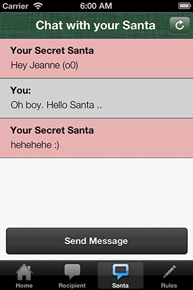
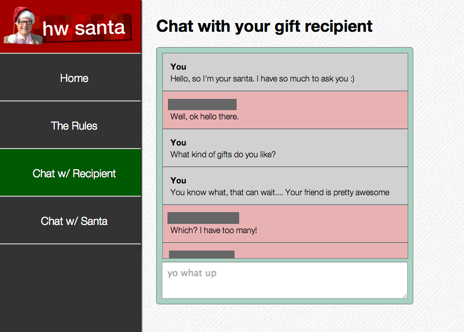

# HW Santa

HW Santa was a game of Secret Santa that took place at Harvard-Westlake High School during the holiday season of 2012. This game was realized through a two week collaborative effort from David Lim who designed HW Santa and myself who developed it. We thought HW Santa would be loads of fun, and together, we built the HW Santa service and graciously received approval and blessing from the school administrators. HW Santa allowed classmates to sign up for a school-wide game of Santa Santa with a twist 😉. Students participated in the HW Santa game using either the iPhone app available on the App Store (which was miraculously approved in just one day by Apple's expedited approval channel) or the online hwsanta.com website.

## Game Process

**Signup Period**

HW Santa began with a signup process. Anyone interested in participating signed up with their name and email during the period.

**Gift Recipient Selection Period**

After the signup process concluded, the participants then chose their secret 'gift recipient' from five random recipient choices. This process was handled live by the system and ultimately, the last five people to select had fewer than five recipient choices.

**Gift Pairing Communication Period**

With their 'gift recipients' decided, they could immediately chat with them through either the HW Santa app or website ..except that only one of the chat participants knew who the other was! Likewise, each participant could chat with their respectivee 'gift giver', and in each gift pairing, the gift giver's identity was left anonymous in this period. By chatting with each other, the gift pairs could talk to each other about gift hints, tease about their identities, or discuss whether they needed to give their gift early because someone was leaving for vacation early.

**Gift Day**

After a week of this secret communication period, the last day of school came, and that meant that it was gift day! Participants both gave and received gifts throughout the day, and learned their gift giver's identity either in person or through HW Santa at the end of the day.

## Results
HW Santa ended up with 151 participants, exceeded our expectations, and led to so much much-needed joy during the horribly intense last two weeks before Winter Break. The gifts given ranged from Kurt Vonnegut books to movies to colored socks. Looking back, I am most surprised that the game did not end up in a complete disaster. Instead it was a very pleasant and suprising success and a great way to end the year. What a relief!

## License

HW Santa is [GNU GPL v3 licensed](./LICENSE?raw=true). All of the projects are available for public use, however they are not meant to be resused and are frankly very outdated now (the Xcode project does not compile with the latest version of Xcode).

## Screenshots

**iOS App**

**Web**

